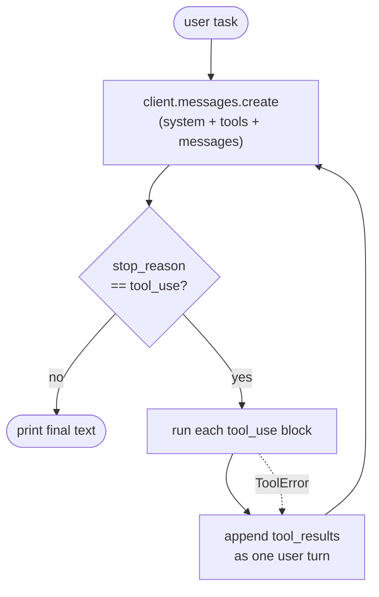

# Claude Code, From Scratch

Rebuilding Claude Code from first principles to learn agentic engineering — and to
see how far the irreducible skeleton gets us on SWE-bench.

## The thesis

Claude Code is ~1.6% AI decision logic and ~98.4% deterministic infrastructure.
The "AI" part is a simple `while` loop. This repo starts from that loop and adds
the surrounding systems one at a time, measuring as we go.

## The skeleton (what's here now)

```
src/cc/
  agent.py        # THE LOOP: model → tool calls → results → repeat
  prompts.py      # system prompt (identity + operating rules)
  cli.py          # entry point: pick workdir, read task, run loop
  tools/          # the agent's surface area on the world
    base.py       #   Tool ABC: name + description + input_schema + run()
    bash.py       #   run shell commands (the workhorse)
    read.py       #   read a file with line numbers
    write.py      #   create/overwrite a file
    edit.py       #   exact-string replacement (read-before-edit invariant)
    glob.py       #   find files by name pattern
    grep.py       #   search file contents by regex
    __init__.py   #   registry: default_tools()
```

The loop is the whole point. Everything else feeds it:

1. **LLM client** — Anthropic Messages API (`claude-opus-4-8`), adaptive thinking.
2. **Agent loop** (`agent.py`) — send messages + tools, execute any `tool_use`
   the model returns, append results, repeat until `stop_reason != "tool_use"`.
3. **Tools** — each is `name + JSON-schema + run()`. Six of them give "infinite
   surface area."
4. **System prompt** — sets the working context and a few hard rules.
5. **Conversation state** — an append-only `messages` list (assistant turns are
   appended verbatim so thinking/tool_use blocks survive).



For the full write-up — stack, structure, and design decisions — see
[docs/system-design.md](docs/system-design.md).

## Setup

```bash
uv sync                       # or: pip install -e .
cp .env.example .env          # add your ANTHROPIC_API_KEY
```

## Usage

```bash
# Run against the current directory
uv run cc "what does this project do? summarize the architecture"

# Point it at another repo and give it a task
uv run cc -C /path/to/repo "fix the failing test in tests/test_foo.py"

# Pipe a task in
echo "add a --json flag to the CLI" | uv run cc
```

## Roadmap (layering toward a SWE-bench number)

The skeleton is enough to act on a real repo. Next, in rough priority order for a
benchmark:

- [ ] **SWE-bench runner** — apply the agent to a task instance, extract the
      `git diff` as the prediction, score with the official harness.
- [ ] **Context compaction** — summarize history when the trajectory grows long
      (long agentic runs are where naive agents fall over).
- [ ] **Streaming output** — token-level visibility during long turns.
- [ ] **Sub-agents** — a `task` tool that spawns a nested loop for parallel work.
- [ ] **Trajectory logging** — record every step for debugging and analysis.
- [ ] **Permission/gating layer** — for interactive (non-benchmark) use.

## Background

Architecture grounded in public reverse-engineering of Claude Code:
[Claw Code](https://www.eigent.ai/blog/claw-code) ·
[Rust rewrite analysis](https://dev.to/brooks_wilson_36fbefbbae4/claude-code-architecture-explained-agent-loop-tool-system-and-permission-model-rust-rewrite-41b2) ·
[learn-claude-code](https://github.com/shareAI-lab/learn-claude-code)
